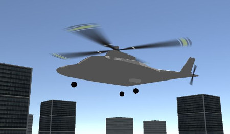
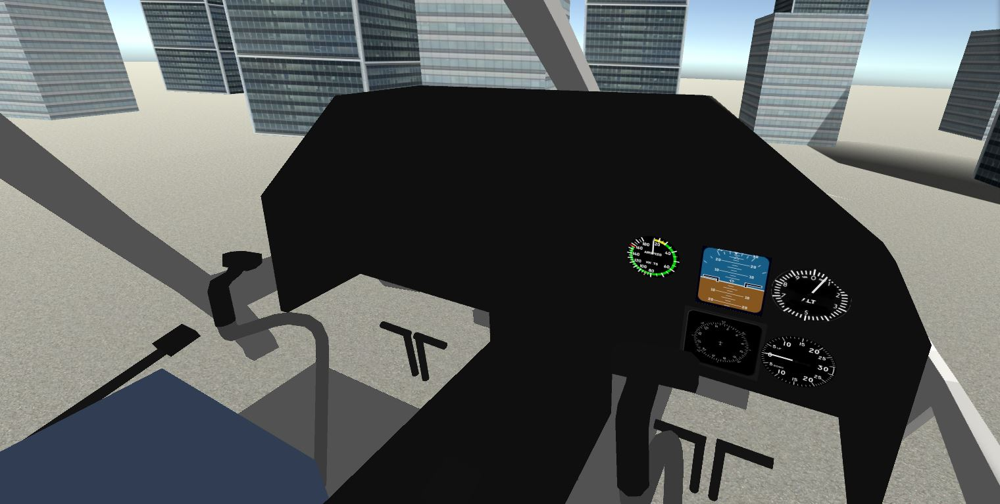

# UnityHeliKit - a Helicopter Simulation Toolkit for Unity3D

This is a helicopter simulation toolkit for the [Unity3D](http://unity3d.com/) game engine. 
The idea is to bring the dynamics model [HeliSharp](https://github.com/minsulander/helisharp) into Unity, 
and also use the Unity Editor for parametrization and visualization of model parameters. 

The project is divided into two parts, aimed at being providable as Unity asset packages:
- UnityHeliKit - all the assets needed to get a helicopter simulation up and running
- UnityHeliKit Examples - a minimal scene and example helicopter model

The author is also working on a more feature-rich demo which will be provided as a 
downloadable executable, as it will be built using proprietary components from the
Unity Asset Store and elsewhere.

Be aware that this project is in an early stage of development.

## Prerequisites

You need [Unity3D](http://unity3d.com/). Version 5.5.0 (Windows and Linux) was last tested.

## Building and running

Clone or download the project, open it up in Unity, open the example scene and hit run.
You won't be able to try it out much unless you have a joystick or gamepad. Unless you're using an Xbox controller you
will need to remap your joystick inputs in the Edit / Project Settings / Input menu.

## Please get in touch

UnityHeliKit is an open source project. If you intend to use it for any purpose,
personal or commercial, please [contact the author](mailto:martin@insulander.com). I'd love to know what you make 
out of it. If you have simulation or game development experience and would like to
contribute, please feel free to submit issues and/or pull requests, and [contact me](mailto:martin@insulander.com).

## License

This project is licensed under the Apache License 2.0 - see the [LICENSE](LICENSE) file for details.

